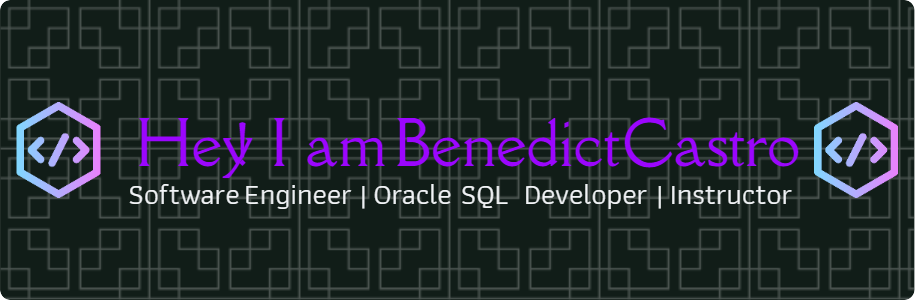

# Hi, I'm Benedict Castro 👋

🚀 Software Engineer | Full Stack Developer | AWS & DevOps Enthusiast  

I build scalable web applications and cloud-native systems using modern technologies.

---

## 🔧 Tech Stack

**Frontend**
- React.js, Tailwind CSS, JavaScript (ES6+)

**Backend**
- Java Spring Boot, REST APIs, Microservices

**Database**
- MySQL, Oracle

**DevOps & Cloud**
- AWS (EC2, S3, RDS, CloudWatch)
- Docker, Kubernetes
- Jenkins, CI/CD Pipelines

---

## 📌 Featured Projects

### 🔐 Full Stack Authentication System
- Spring Boot + MySQL + Thymeleaf
- Role-Based Access Control (ADMIN/USER)
- Secure login, session management

👉 [View Repository](#)

---

### ⚙️ CI/CD DevOps Pipeline
- Jenkins + Docker + Kubernetes
- Automated build & deployment pipeline
- Containerized app deployed on Minikube

👉 [View Repository](#)

---

### 🛒 React E-Commerce UI (ShopSphere)
- React + Tailwind CSS
- Responsive UI with reusable components

👉 [View Repository](#)

---

## 🌐 Portfolio
🔗 https://www.benmoncast.com/

## 📫 Contact
📧 benmoncast@gmail.com  
🔗 LinkedIn: https://linkedin.com/in/benedict-castro

---

⭐ Always learning. Always building.
